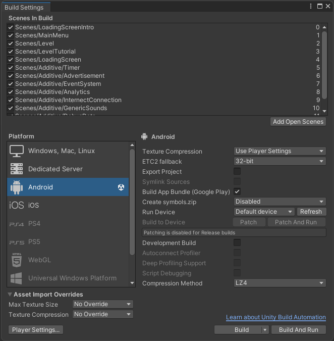
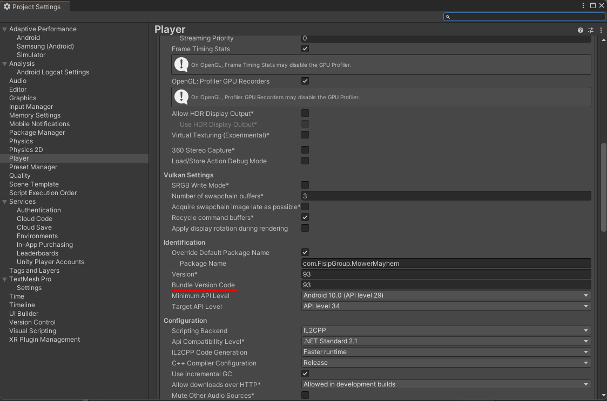
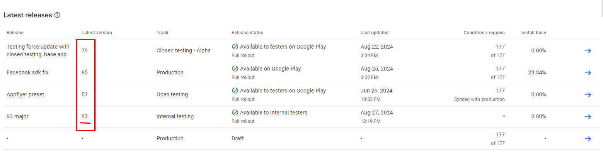
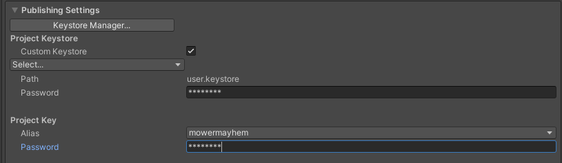
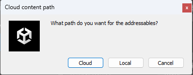
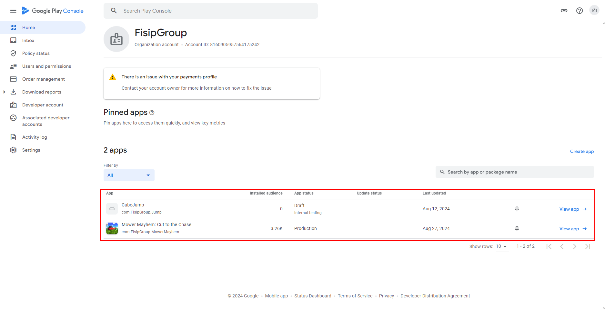
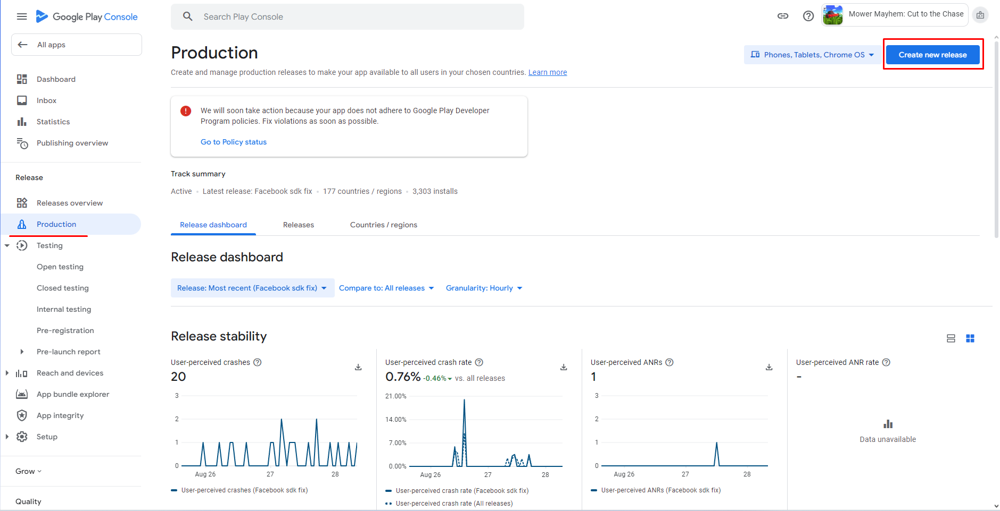
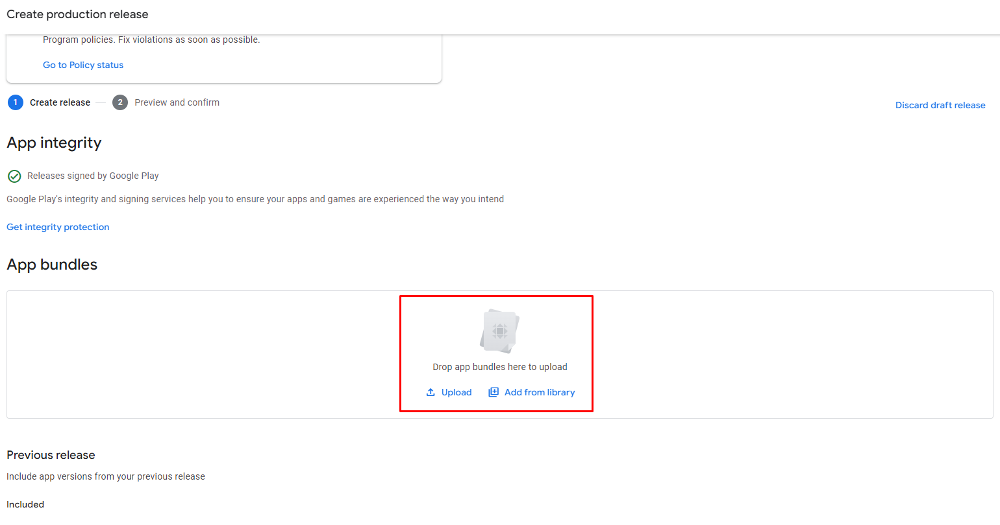
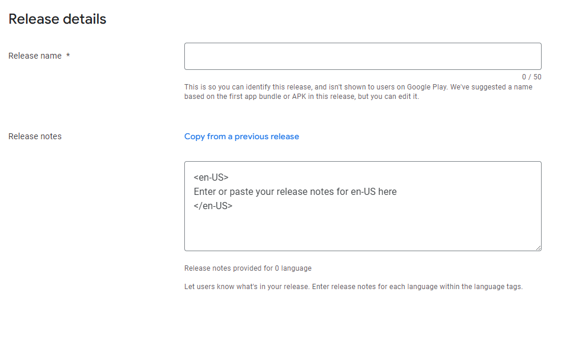

# How to publish for the Android Platform
## About
Here's the documentation on how to publish an apk to the Google's Play Store. 

[Google Play Console Dashboard](https://play.google.com/console/u/2/developers/)

## Requirements
- Google developer account
(Should be created with the fisipgroup email)

- Be on FisipGroup's google organization.
- Have the right permissions.

## Build the APK/AAB
1. Go to `File -> Build Settings`.
2. Make sure the `Build App Bundle (Google Play)` checkmark is on, and the `Development Build` is off.

3. Go to `Player Settings... -> Other Settings`.
4. Increment the `Bundle Version Code` value.
    - Make sure it's one value above the last published build.
    - If the `FisipGroup Addressables` custom package is *NOT* integrated, change the `Version` to the same value, otherwise it will update automatically.
    
    - You can find the last published build on the overview page `Home -> App -> Releases Overview`: [Google Play Console Dashboard](https://play.google.com/console/u/2/developers/)
    <figure markdown="span">
    
        <figcaption>The highest one on all tracks</figcaption>
    </figure>
5. Set keystore's password on `Publishing Settings`. The password should be on a text file inside the project on `Assets -> Help -> SigningKeyPassword`. 
    
If not contact a developer that worked on the specific game.

6. Go back to `Build Settings` and press `Build` or `Build and Run` to build an `.abb` file.
7. Save the `.abb` file on a location of preference.
8. If the `FisipGroup Addressables` custom package is integrated, select if you want some of the game files to be loaded from the `Cloud` or be added to the `.abb` file.

## Publish on Google Play Console
1. Go to the [Google Play Console Dashboard](https://play.google.com/console/u/2/developers/).
2. Select the game app you are working on.

3. Go to the `Release` section and select the type of release.
4. Select `Create new release`. If the button is greyed out there is a draft of a release already and instead go to `Releases -> Edit Release`.

5. Drag the `.abb` file to the App Bundles box.

6. Add the `Release name` and `Release notes`. 
For the release notes we usually go to gitkraken or trello and get a list of all the tasks done since last release. Only important on `production` releases.

7. Press `Next` once the `.abb` file as been uploaded and the notes added.
8. Select `Save and publish`.