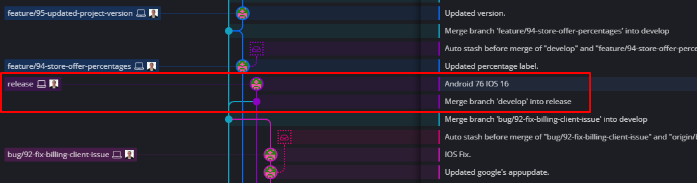

# How to organize release builds on Github

## About
For releases must follow a structure that keeps the repository organized.

## What to do when sending a production release
Before sending a production release we usually merge the `develop` branch into the `release` branch and set the name to whatever version we are releasing.

Make sure the app was tested thoroughly before doing so.

