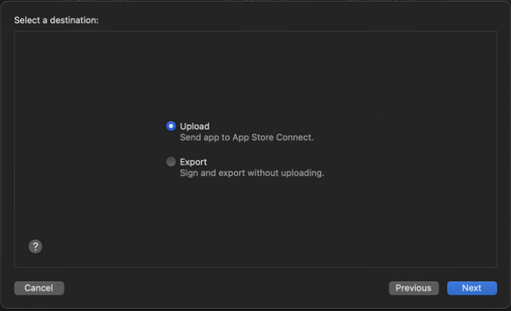

# How to publish for the IOS Platform
## About
Here's the documentation on how to publish an apk to the Apple's App Store. 

[App Store Connect Dashboard](https://appstoreconnect.apple.com)

## Requirements
- App Store Connect account.
(Should be created with the fisipgroup email)

- Be on Fisip Group Ltd organization.
- At least have the App Manager permission.
- A mac Computer.
(The Xcode project file can be generated on windows, however the publishing part can only be done on mac)

## Build the XCode project file
1. Go to `File -> Build Settings`.
2. Make sure  `Development Build` is off.

3. Go to `Player Settings... -> Other Settings`.
4. Increment the `Build` value.
    - Make sure it's one value above the last published build.
    - If the `FisipGroup Addressables` custom package is *NOT* integrated, change the `Version` to the same value, otherwise it will update automatically.
    
    - You can find the last published build on `Apps -> "Game" -> iOS App -> Build`: [App Store Connect Dashboard](https://appstoreconnect.apple.com)
    
5. On `Target SDK` select `Device SDK`.

6. Go back to `Build Settings` and press `Build` or `Build and Run`.
    - If building on windows, the `Build and Run` feature is disabled.
7. Save the Xcode Project files on a location of preference.
8. If the `FisipGroup Addressables` custom package is integrated, select if you want some of the game files to be loaded from the `Cloud` or locally.

## Upload app for publishing from XCode
1. Open XCode project.
    - If the `Build and Run` build option was selected previously, it should open automatically.
2. On `Signing & Capabilities -> Team` make sure the right `Team` is selected.

3. On Xcode select `Product -> Archive` and wait for it to archive.

4. Once the `Archives` window opens select `Distribute App`.
5. Select the `Custom` option and press `Next`.

6. Select the `App Store Connect` option and press `Next`.

7. Select `Upload` and press `Next`.

8. Select `Upload your app's symbols`, `Manage version and build number` and press `Next`.

9. Select `Automatically manage signing` and press `Next`.

10. Select `Upload`.

11. Once the `Upload` is done press `Done`.
    - You can now close the Xcode project.

## Release app on Apple Store