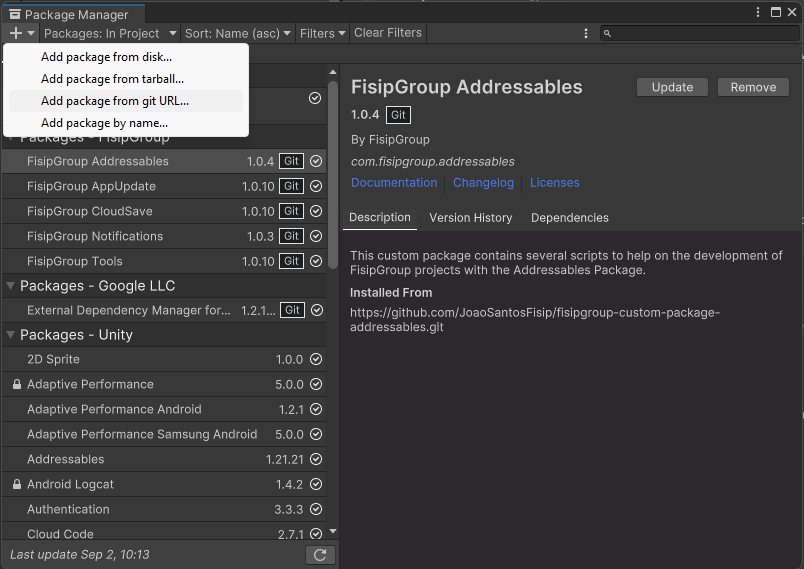

# Custom Packages
## About
To help on the development of the games several `Custom Packages` were created to speed up the development process and remove the need to develop the same thing twice.

All the developed custom packages repo's can be found here: [Github Repositories](https://github.com/JoaoSantosFisip?tab=repositories&q=fisipgroup-custom-package-&type=&language=&sort=)

## How to add custom packages
1. On the unity project go to `Window -> Package Manager`.
2. Press the plus sign on the top left of the window and select `Add package from git URL...`.

3. Paste the `git URL` and select `Add`.
    - The `git URL` can be found on the github's repo page `<> Code` section.
    
4. Make sure you add the dependency packages as well.

## How to update custom packages
1. On the unity project go to `Window -> Package Manager`.
2. Select the custom package you want to update.
    - Our packages should be on the `Packages - FisipGroup` section.
3. Select `Update`.
    - The `Update` button will always be available to press even if no extra update is available.