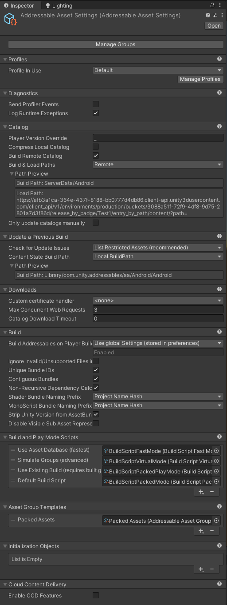
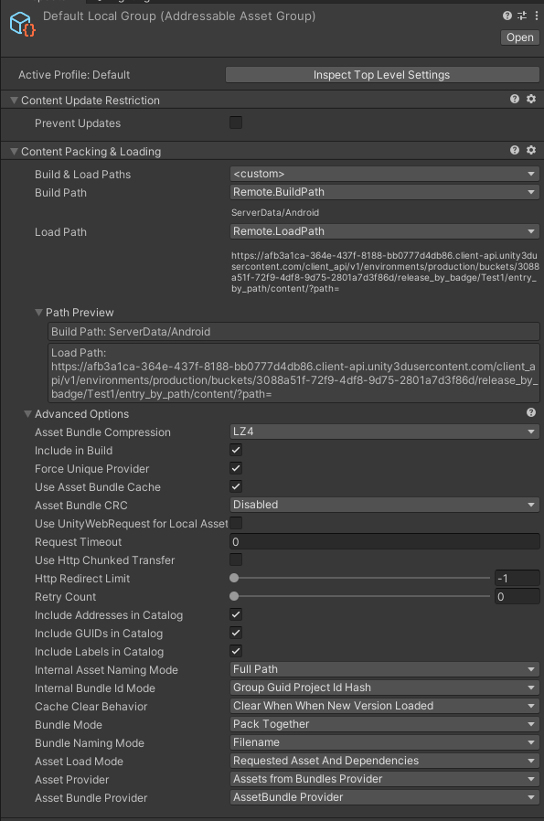

# Recommended Settings
## About
Through development we experimented a lot with several settings. We ended up with these ones since we feel these ones match better with the structure we are following at the moment.

The `Remote` load path is already set by the custom package scripts.

## AddressableAssetSettings

## Packet Assets

## Default Local Group
These settings are also applicable to the other `AssetGroups`.
