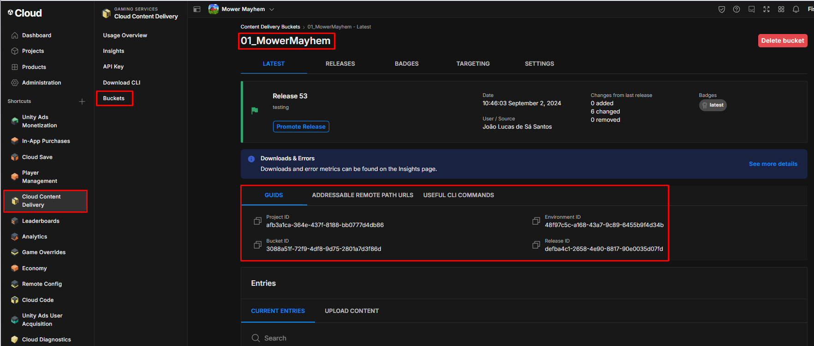

# Setup
For the `Addressables Custom Package` to work a small setup is necessary, here's the steps:

[Github Repository](https://github.com/JoaoSantosFisip/fisipgroup-custom-package-addressables)

## Requirements
- Unity Services account.
- Be a member of the FisipGroup organization and have `Manager` permissions. (Permissions might need necessary, confirm pls)
- Add dependency packages:
    - Addressables.
    - Fisipgroup Tools Custom Package.

More info on how to add custom packages here:  [Add package from git URL](https://joaosantosfisip.github.io/fisipgroup-mkdocs-documentation/custompackage_guide_giturl/);

## Set recommended settings
To make sure the addressables work properly we recommend using the recommended settings.
They can be found here: [Recommended Settings](https://joaosantosfisip.github.io/fisipgroup-mkdocs-documentation/custompackage_addressables_settings/);

## Add Info to the Scriptable Object
1. On the unity project go to `Fisipgroup -> Addressables`.
2. Add the necessary info.
    - All the ID's can be found on the `Cloud Content Delivery -> Buckets -> "Platform bucket" _> GUID's`.
    
    - For the `Badge` value can be found on the `BADGES` section, copy and paste the name of the release badge you want to download assets from.
3. Back to the Unity's `FisipGroup Addressables` window under `Tools` select `Save and Update` to make sure the profile remote URL is updated.
