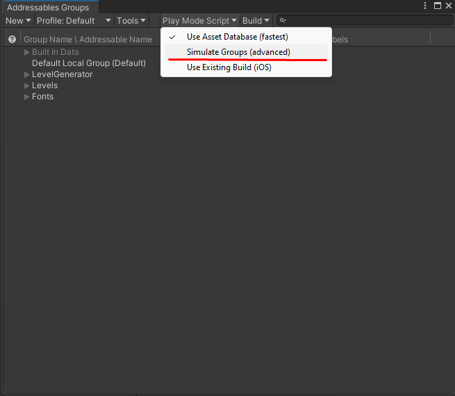

# Simulate addressables download in Unity Editor
## About
Sometimes in development we want to simulate the addressables download and cache to test properly if our code is working correctly.

## Simulate download
1. On Unity editor go to `Window -> Asset Management -> Addressables -> Groups`.
2. Select `Play Mode Script -> Simulate Groups (Advanced)`.
    - 

After this the addressables will be stored in cache.

## Clear build cache 
1. On Unity editor go to `Window -> Asset Management -> Addressables -> Groups`.
2. Select `Build -> Clear Build Cache -> All`.