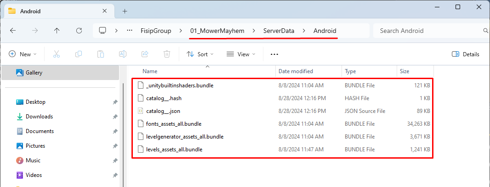
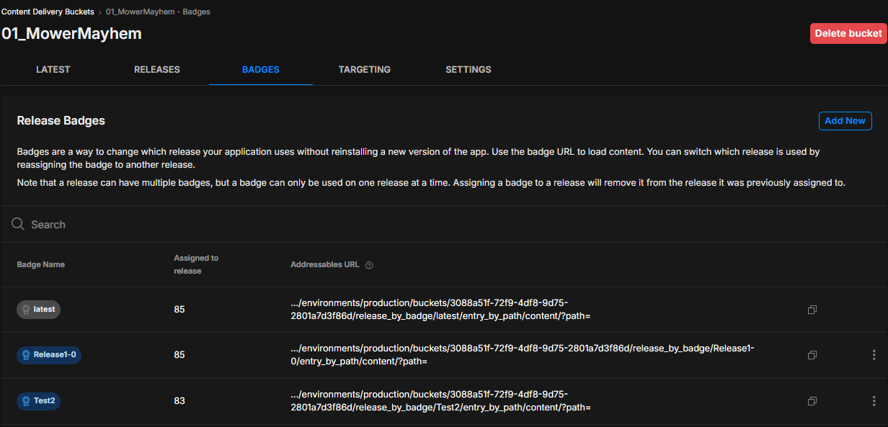
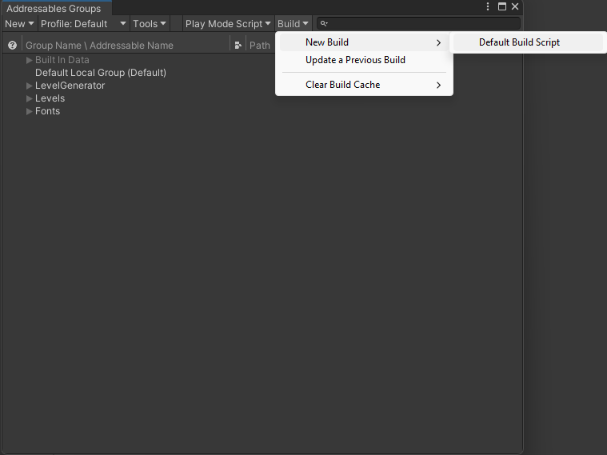
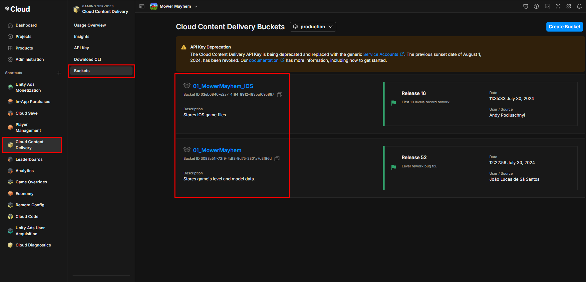
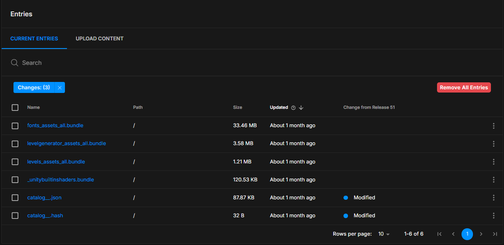

# How to Update Addressables

## About
Here are the steps on how to update the projects `Addressables` when using the `Cloud Content Delivery` unity service and our custom package. 

## Requirements
- Unity Services account
- Be a member of the FisipGroup organization and have `Manager` permissions.
- Addressables custom package added.

## Delete Old Addressable Files
1. Go to `"Project Root" -> ServerData -> "Selected Platform"`.
2. Delete all files inside folder.

## Build addressables
1. Go to `FisipGroup -> Addressables`.
2. On `Badge` select which badge you want to build to or create a new one.
    - On [Unity Services Dashboard](https://cloud.unity.com/home) go to `Cloud Content Delivery -> Buckets -> Select right Bucket -> Badges` to see what badges are available and create a new one.
    
    - If the changes are very minor and you don't need to create a new whole release you can just set the last used `Badge` to the this release.
3. Under the `Tools` section select `Save and Update`.
4. Go to `Window -> Asset management -> Addressables -> Groups`.
5. Select `Build -> New Build -> Default Build Script`.

## Update Unity Services
1. Go to [Unity Services](https://cloud.unity.com/home).
2. Go to `Cloud Content Delivery -> Buckets`.
3. Select the correct platform bucket for the game.

4. Press `Remove All Entries`.

5. Go to `Upload Content`.
6. Enable `Automatically create release after the upload`.
7. Drop the new built files.
8. Press `Upload "x" Files`.
9. Add notes describing the changes on these new addressables.
10. Select the `Badge` you are going to use on this release.
    - If you haven't created the `Badge` for the new release beforehand you can do so after the upload. 
11. Press `Upload & Create Release`.
12. Once the upload is done select `Refresh Page`.

## Create or set new Badge
1. - On [Unity Services Dashboard](https://cloud.unity.com/home) go to `Cloud Content Delivery -> Buckets -> Select right Bucket -> Badges`.

### Create new Badge
1. Select `Add new`.
2. Enter the new badge name.
3. Select which release you want to have that badge.
4. Press `Submit`.

### Set new Badge
If the changes are very minor and you feel like you don't need to create a new whole release you can just set the last used `Badge` to the latest release.

1. Select the `Three dot` icon on the right of the badge and select `Edit Badge`.
2. Select which release you want to have that badge.
3. Press `Submit`.

## Update Info Scriptable Object
1. On the unity project go to `FisipGroup -> Addressables`.
2. Update `Ios Release ID` or `Android Release ID` with the new `Release ID`.
    - All the ID's can be found on the `Cloud Content Delivery -> Buckets -> "Platform bucket" _> GUID's`.
3. Select `File -> Save` to make sure the changes are added.

## Test
Build apk for device and test if working properly.