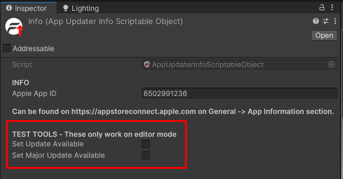

# Tools
On the `AppUpdate` info scriptable object several tools can be found for testing purposes on the Unity Editor. 

To access these tools on the Unity project go to `Fisipgroup -> Addressables`.

You can check both `Set Update Available` or `Set Major Update Available` to simulate the app having specific types of updates.

`Set Major Update Available` will only work if `Set Update Available` is enabled.

