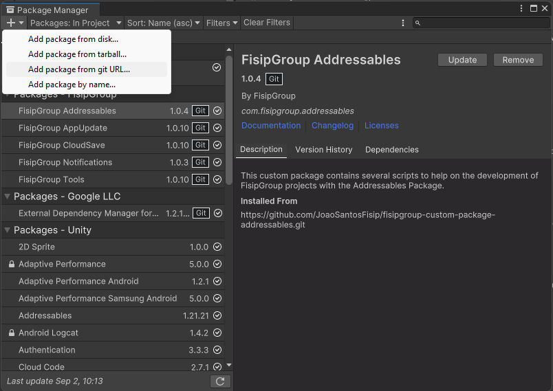
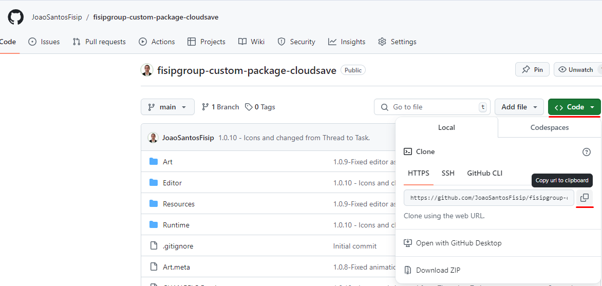

# How to install a package via git URL
1. Find the github's repository page of the package you want to add.
2. On the unity project go to `Window -> Package Manager`.
3. Press the plus sign on the top left of the window and select `Add package from git URL...`.

4. Paste the `git URL` and select `Add`.
    - The `git URL` can be found on the github's repo page `<> Code` section.
    
5. Make sure you add the dependency packages as well.