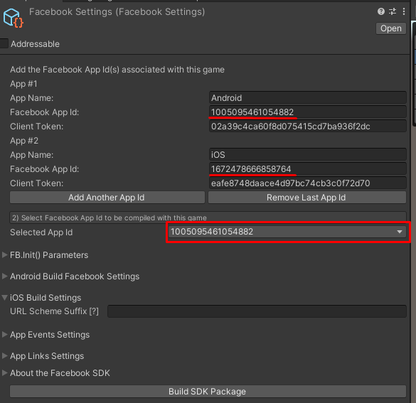

# Mower Mayhem Release Checklist
## About
Before sending a release version of the game, there are several steps that we should do to make sure the APP is ready.

## Addressables
During the development of `Mower Mayhem`, we may make changes to assets such as `Levels`, `Models`, and `Fonts`. These assets are downloaded at the start of the game, so it’s important to ensure they are correctly updated in the cloud.

To test these updates:

- Select the `Cloud` option when building for mobile.
- Verify that the Levels, Models, and Fonts in the game match those in the Unity Editor.

If it doesn't follow the steps on how to [Update Addressables](https://joaosantosfisip.github.io/fisipgroup-mkdocs-documentation/custompackage_addressables_update/).

## FACEBOOK SDK
For the Facebook SDK we have two `IDs`, one for `Android` and another for `iOS`. Before building the APK, we need to make sure that we are using the correct `ID`.

To check the settings:

1. On the Unity Editor go to `Facebook -> Edit Settings`.
2. Change `Selected App Id` to the correct one depending on the current platform.

## Publish Steps
After checking the previous steps just follow the [Github Upload Steps](https://joaosantosfisip.github.io/fisipgroup-mkdocs-documentation/base_publish_github/) and then [Android Upload Steps](https://joaosantosfisip.github.io/fisipgroup-mkdocs-documentation/base_publish_android/) or [iOS Upload Steps](https://joaosantosfisip.github.io/fisipgroup-mkdocs-documentation/base_publish_ios/) depending on the platform you are publishing for.